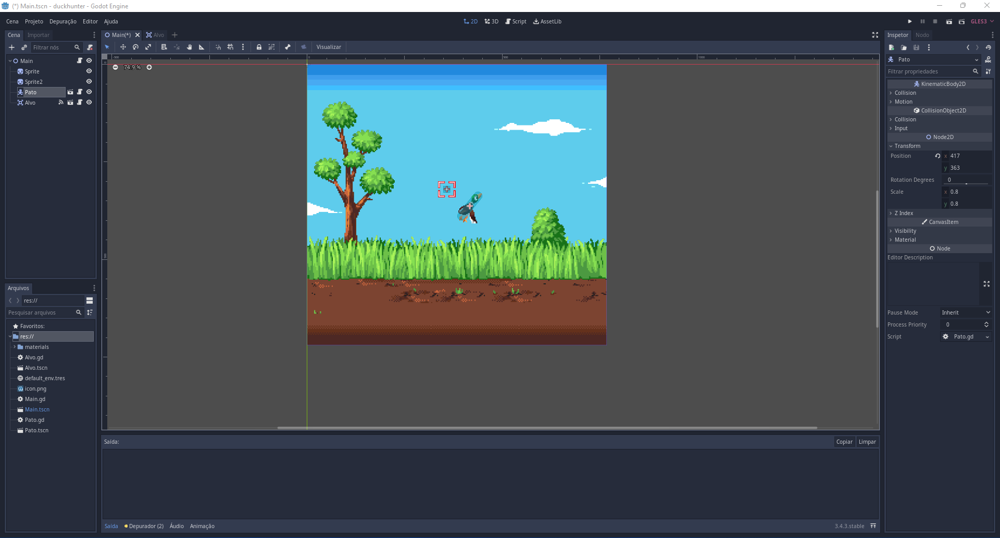
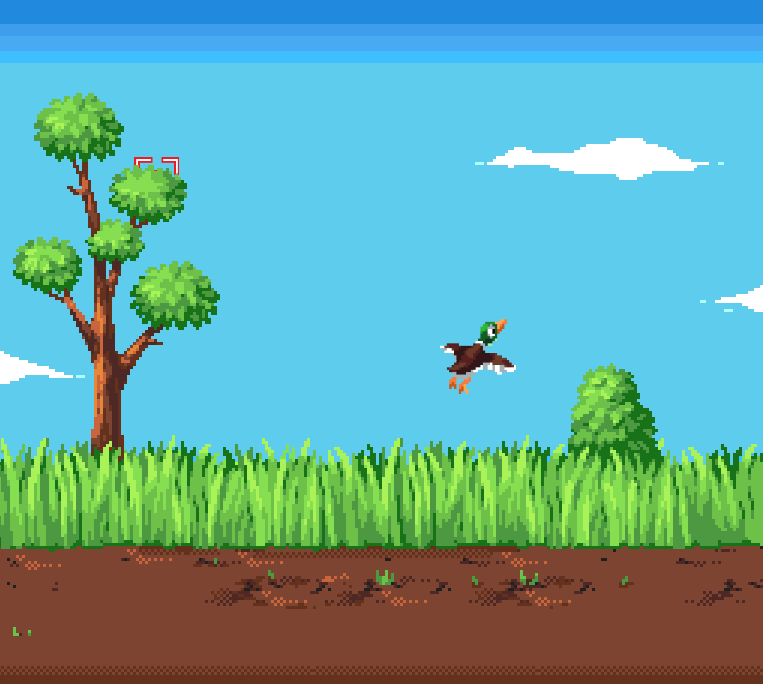

# Duck Hunter clone

este projeto tem como objetivo o estudo sobre mecanicas e desenvolvimento de jogos

## Como executar

Para executar este projeto é necessario ter o a game engine [Godot](https://godotengine.org/) e ter um conhecimento minimo sobre a plataforma. Neste caso, pode olhar as imagens abaixo para poder entender como o jogo está 

### Tela de desenvolvimento

### Jogo rodando

